# MedFlow — Healthcare Operations Dashboard

A healthcare operations dashboard UI for managing patients, admissions, doctors, laboratory orders, billing, pharmacy, and appointments. The application includes role-based access, patient charts, reporting, localization, and responsive UI interactions.

Built with React, TypeScript, and Vite.

## Live Demo

**[Try it online →](https://med-flow-amber.vercel.app)**

## Running locally

```bash
# install dependencies
npm install

# start the development server
npm run dev
```

Then open the local URL shown by Vite in your browser.

## Features

| Feature            | Description                                                                            |
| ------------------ | -------------------------------------------------------------------------------------- |
| Overview Dashboard | Hospital-wide KPIs, activity summaries, alerts, and operational metrics                |
| Patient Management | Patient admissions, records, vitals, goals, and individual patient charts              |
| Doctors            | Manage doctor records and related information                                          |
| Laboratory         | Track laboratory orders and their status                                               |
| Billing            | Manage invoices and billing records                                                    |
| Pharmacy           | Manage medications and pharmacy records                                                |
| Appointments       | View and manage scheduled appointments                                                 |
| Role-Based Access  | Six user roles with permission-gated navigation and routes                             |
| Reports            | Generate reports from application data with CSV export and print support               |
| Localization       | Multi-language interface with translated navigation, forms, statuses, and patient data |
| Responsive UI      | Layouts and controls designed to work across different screen sizes                    |
| Animations         | Page transitions, modal animations, KPI counters, and list interactions                |
| Settings           | Application preferences including language and appearance options                      |

## Project structure

```text
src/
├── app/
│   ├── App.tsx
│   └── ...
│
├── components/
│   ├── charts/
│   ├── dashboard/
│   ├── layout/
│   └── ui/
│
├── data/
│   └── mock/
│
├── features/
│   ├── auth/
│   ├── overview/
│   ├── patients/
│   ├── reports/
│   ├── resources/
│   └── settings/
│
├── i18n/
├── state/
├── types/
├── utils/
└── styles/
```

### Feature organization

The application is organized around feature areas rather than keeping all pages and components in a single directory.

- `app/` — application entry point and routing
- `components/` — reusable presentation components
- `data/` — seed and mock application data
- `features/auth/` — login, roles, permissions, and authentication
- `features/overview/` — main operations dashboard
- `features/patients/` — patient charts, vitals, and goals
- `features/reports/` — reporting and data export
- `features/resources/` — reusable CRUD interfaces for hospital resources
- `features/settings/` — application settings
- `i18n/` — localization context, translations, and languages
- `state/` — shared application state
- `types/` — domain and database TypeScript types
- `utils/` — shared utility functions
- `styles/` — global application styles

## Resource management

The generic resource interface is used across several areas of the application:

| Resource     | Purpose                        |
| ------------ | ------------------------------ |
| Doctors      | Doctor records and information |
| Admissions   | Patient admission records      |
| Laboratory   | Laboratory orders              |
| Billing      | Invoices and billing records   |
| Pharmacy     | Medication records             |
| Appointments | Appointment scheduling         |

Resources support common operations such as searching, filtering, adding, editing, deleting, and viewing records.

## Authentication & roles

The application includes six predefined roles with different access levels. Navigation items and protected routes respond to the current user's permissions.

## Patient charts

Patient admissions can be opened into a dedicated chart view containing:

- Patient information
- Vital signs
- Vital trends
- Goals
- Admission-related information
- Clinical actions available according to the user's role

The chart includes a custom SVG-based visualization rather than relying on an external charting library.

## Localization

The interface includes a localization system with translated UI strings across the major application areas.

Translations are accessed through the application's i18n context so that displayed text can change without changing the underlying data values used by the application.

## Reports & exports

Reports use the application's current data and support:

- Report generation
- CSV export
- Print-friendly output

## Gallery

|                                                            |                                             |                                                 |
| ---------------------------------------------------------- | ------------------------------------------- | ----------------------------------------------- |
| **Dashboard**                                              | **Themes**                                  | **Localization**                                |
| 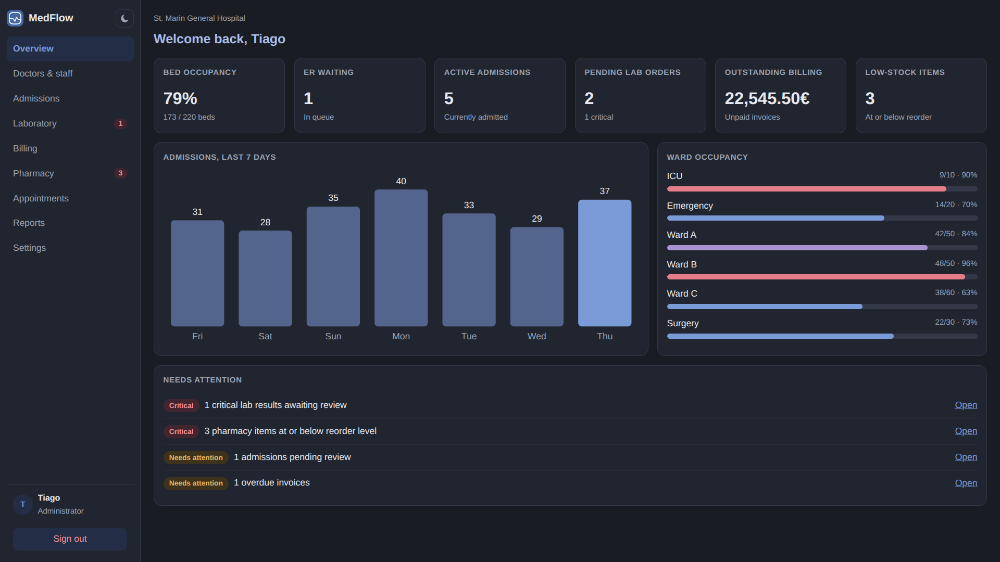                   | 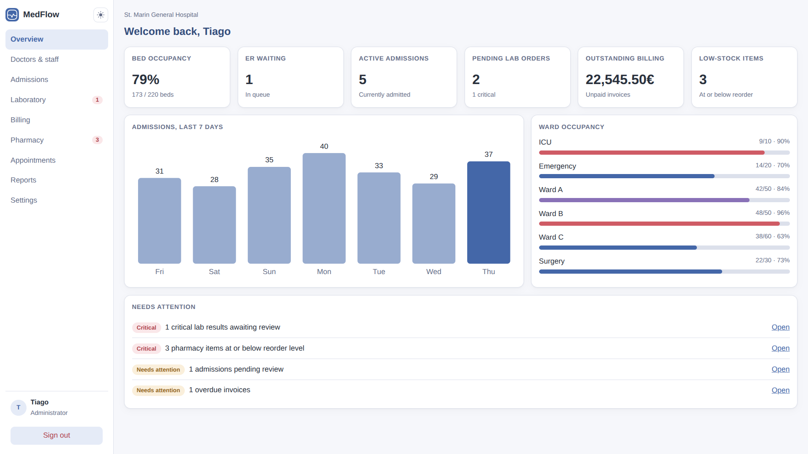 | 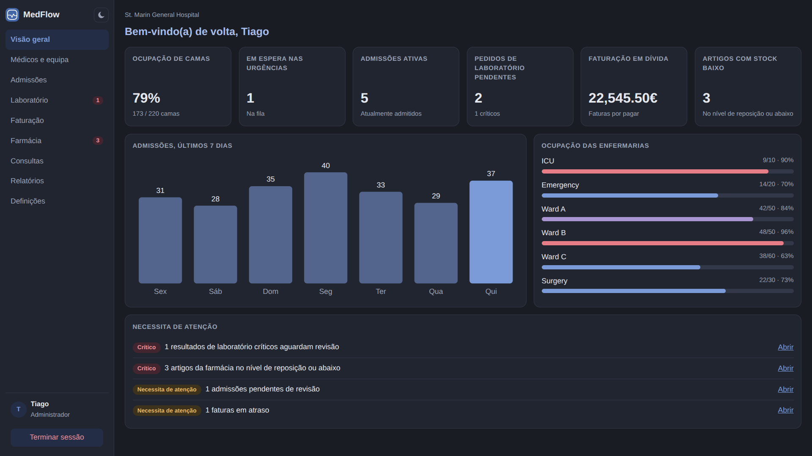 |
| **Staff**                                                  | **Admissions**                              | **Laboratory**                                  |
| 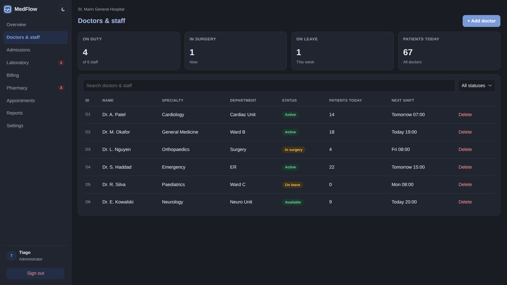                  | 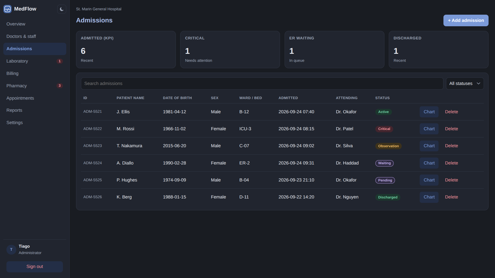 | 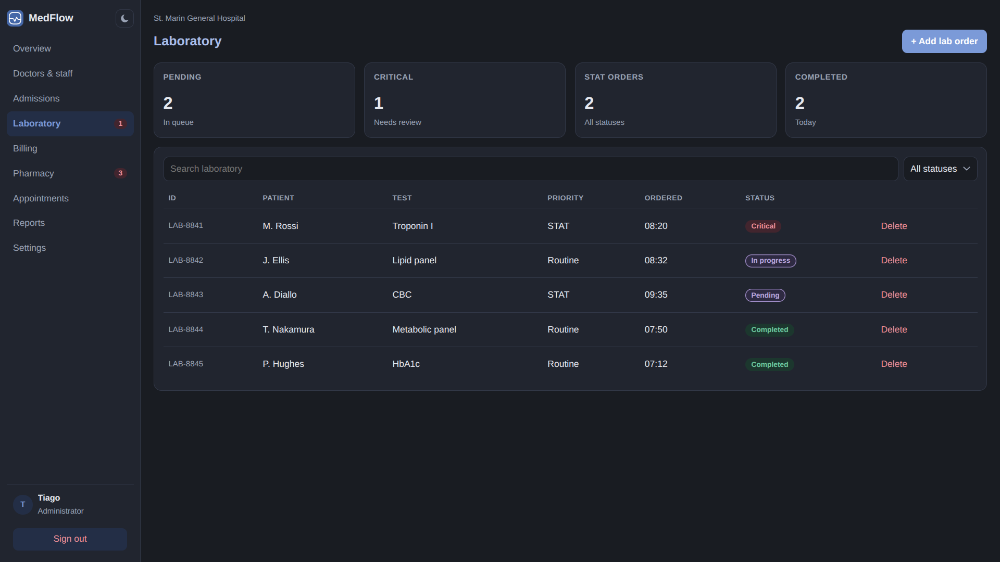     |
| **Billing**                                                | **Pharmacy**                                | **Appointments**                                |
| 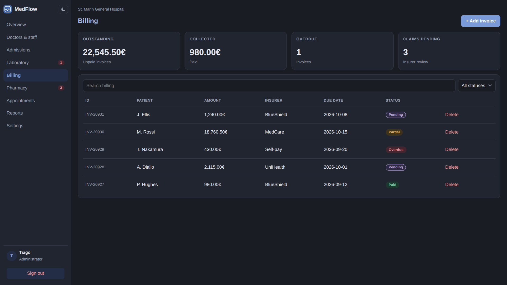                      | 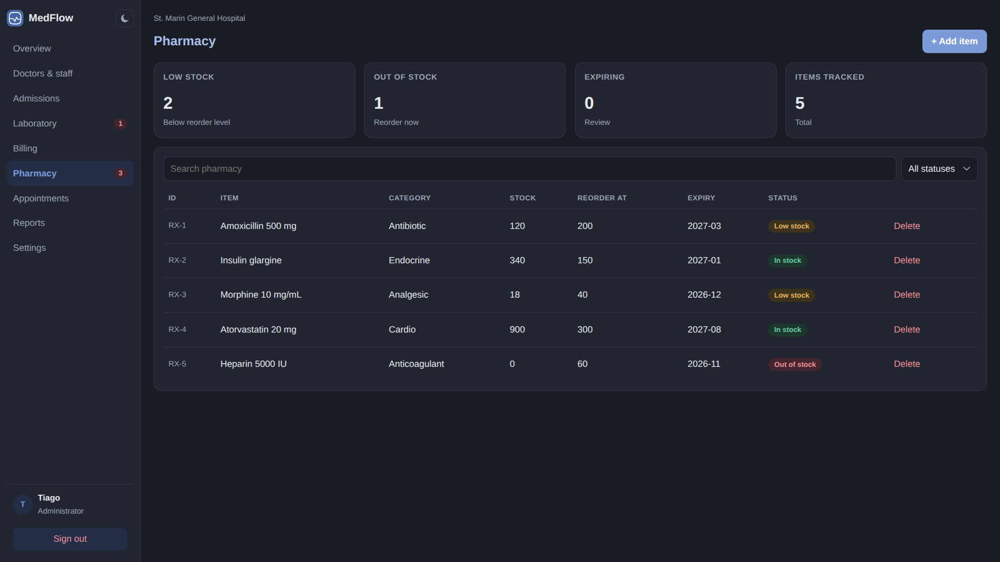     | 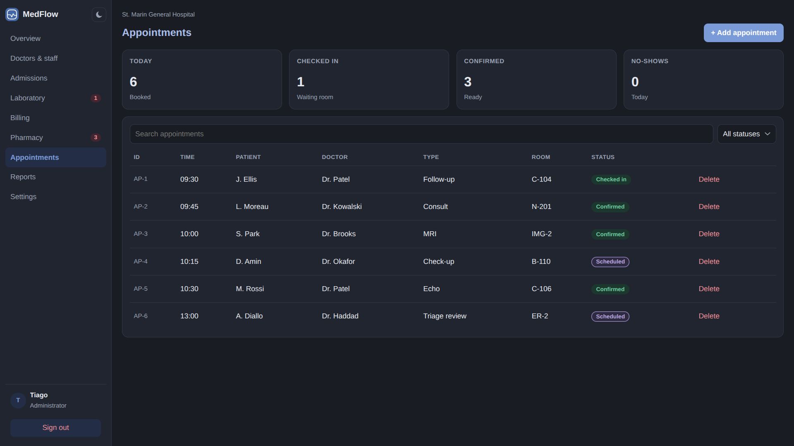 |
| **Patient Charts**                                         | **Reports**                                 | **Settings**                                    |
| 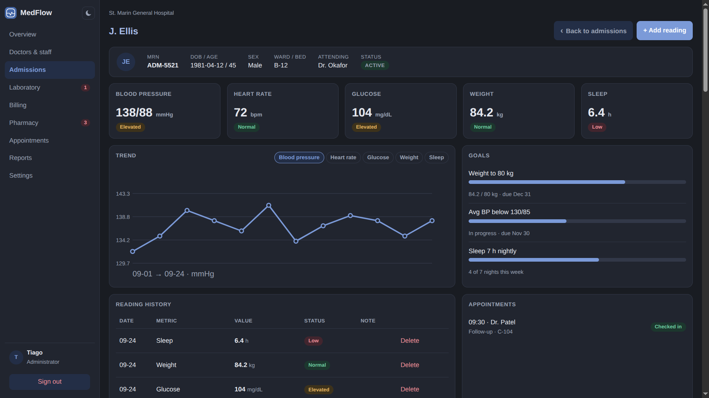 | 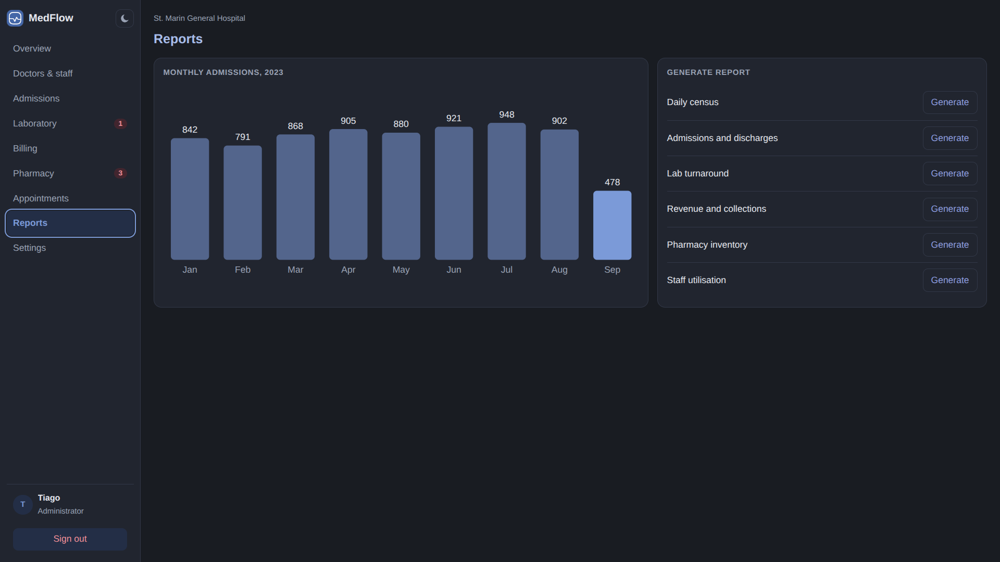       | 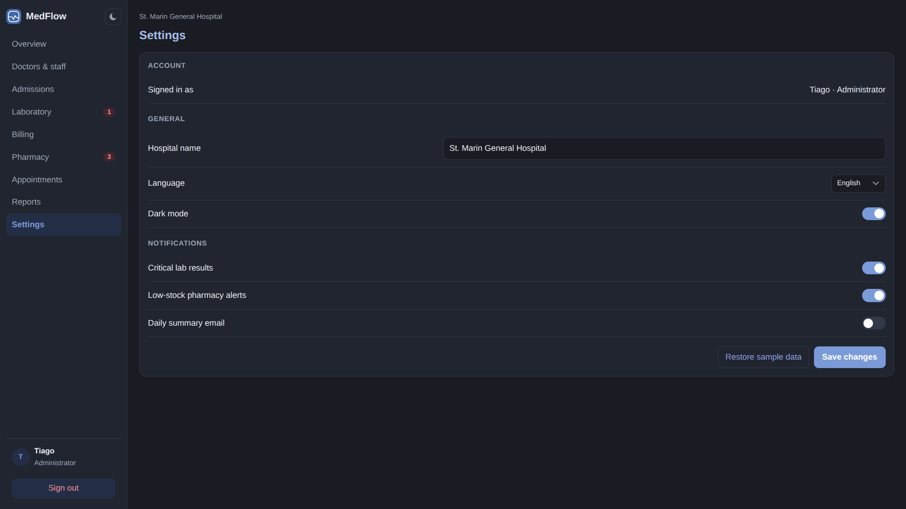         |
|                                                            | **Authentication**                          |                                                 |
|                                                            | 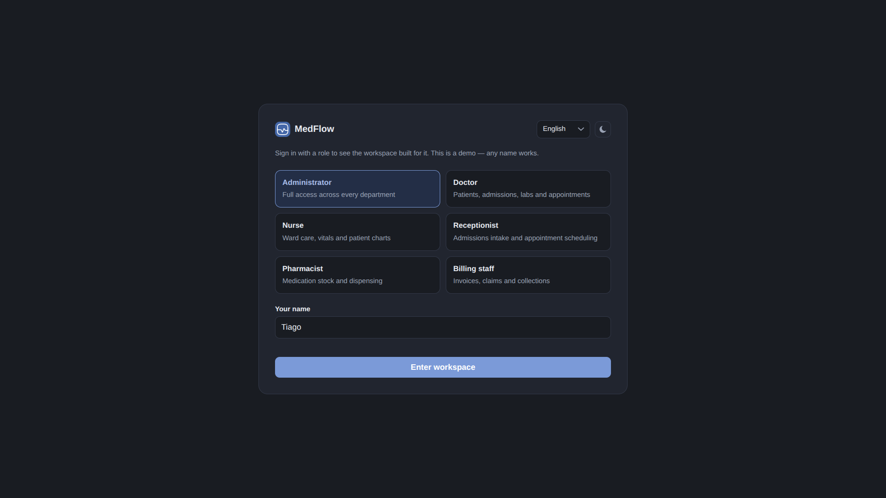  |                                                 |
